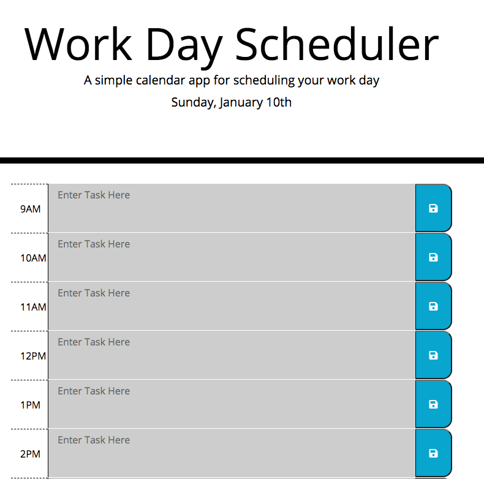

# Work Day Scheduler
AS AN employee with a busy schedule
I WANT to add important events to a daily planner
SO THAT I can manage my time effectively

## Table of Contents:
1. Purpose
2. Requirements
3. Screenshot
4. Link to Webpage:
5. License & Copyright

## Purpose
Saves tasks for the day. Task block color changes based on if it is the past, present or future. Refreshing the page will not clear your tasks.

## Requirements

_GIVEN I am using a daily planner to create a schedule_
_WHEN I open the planner_
_THEN the current day is displayed at the top of the calendar_
_WHEN I scroll down_
_THEN I am presented with time blocks for standard business hours_
_WHEN I view the time blocks for that day_
_THEN each time block is color-coded to indicate whether it is in the past, present, or future_
_WHEN I click into a time block_
_THEN I can enter an event_
_WHEN I click the save button for that time block_
_THEN the text for that event is saved in local storage_
_WHEN I refresh the page_
_THEN the saved events persist_

## Screenshot

## Link to deployed webpage

[Click to view Live Website](https://rajendra-dhanraj.github.io/Work-Day-Scheduler/ "Work Day Scheduler")

## License

MIT